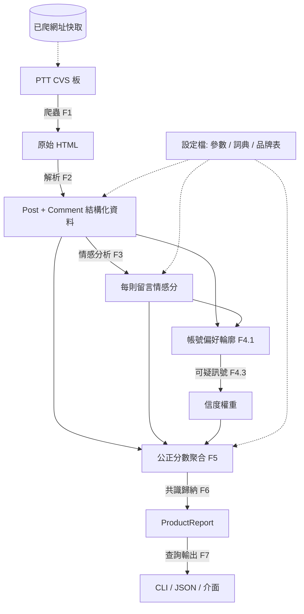

# 超商食物評價雷達 CVS Radar — 產品需求文件 (PRD)

| 項目 | 內容 |
|---|---|
| 文件版本 | **v0.2**(取代 v0.1) |
| 適用範圍 | PTT `CVS` 板 |
| 狀態 | 待需求方確認(見 §16 開放問題) |
| 最後更新 | 2026-06-15 |

### 變更紀錄
| 版本 | 變更摘要 |
|---|---|
| v0.1 | 初版:背景、目標、六大模組功能、資料模型、風險、里程碑。 |
| v0.2 | 新增系統架構圖與資料流;各功能加入**驗收標準**;新增 PTT **解析邊界情況**;演算法升級(貝氏收斂、每人每商品折一票、時間衰減、信度下限、有效樣本數與信心度);新增**隱私與法遵**、**參數設定總表**、**監控與維運**、**多來源整合策略**、**技術選型假設**章節;名詞表與風險登記表擴充。 |

---

## 1. 背景與問題

在超商挑食物時,消費者很難快速判斷一個商品好不好吃:資訊散落在 PTT `CVS` 板;同一商品多篇心得評價可能截然不同,逐篇翻很慢;推文良莠不齊,部分疑似廠商自家帳號互推刷評,降低參考價值;缺乏彙整後的「公正分數」可一眼判斷該不該踩雷。

**目標**:自動蒐集超商食物評價,經清洗、情感分析與可信度加權後,為每個商品產出**可解釋的公正分數**與**評價共識結論**(如「一致好評」「評價兩極」),協助使用者在超商現場快速避雷。

---

## 2. 目標與非目標

### 2.1 目標
- **G1** 自動爬取 PTT `CVS` 板商品文與推文。
- **G2** 解析作者自評分、品牌、商品名與心得。
- **G3** 對推文做中文情感分析,量化正負傾向。
- **G4** 建立帳號品牌偏好輪廓,產生「可疑操作帳號」信度訊號。
- **G5** 以可信度加權算出每個商品的公正分數。
- **G6** 對同商品多篇文章做共識歸納。
- **G7** 提供查詢能力。

### 2.2 非目標(v0 不做)
完整前端網站/App、即時爬取、公開指控真實帳號、跨平台帳號串接。

---

## 3. 名詞定義

| 名詞 | 定義 |
|---|---|
| 商品文 | 標題含 `[商品]` 的評測文,具固定欄位範本 |
| 作者自評分 | 文章 `【評分】` 欄位(通常 0–100,亦可能非數值) |
| 推文 / 留言 | 文章下方回應,帶 `推`/`噓`/`→` 標籤 |
| 推噓分 | 由標籤得到的情感先驗:推 +1、噓 −1、→ 0 |
| 留言情感分 | 對留言文字分析所得,範圍 [−1, 1] |
| 品牌偏好 | 帳號在各品牌商品上的平均情感傾向 |
| 可疑訊號分 | 帳號疑似被操作的啟發式分數(0–1) |
| 信度權重 | 評價被採信程度,受可疑訊號降權 |
| 有效樣本數 (n_eff) | 加權後等效獨立樣本數,衡量結論穩健度 |
| 信心度 | 由 n_eff 推得的結論可靠程度(低/中/高) |
| 公正分數 | 商品經可信度加權與貝氏收斂後的綜合分數(0–100) |
| 評價共識 | 對一商品所有評價離散程度的分類結論 |

---

## 4. 使用者與情境

### 4.1 角色
- **一般消費者(主要)**:現場或出門前查商品,決定要不要買。
- **資料維運者(你)**:維護爬蟲、調參、檢視可疑帳號明細。

### 4.2 使用者故事
- US1 輸入「全家 健身G肉餐盒」→ 看到公正分數 + 一句結論。
- US2 看到「評價兩極,正評說 X、負評說 Y」→ 判斷自己會不會踩雷。
- US3 瀏覽某品牌近期高分商品排行。
- US4(維運)檢視某商品分數由哪些帳號貢獻、哪些被降權。

### 4.3 端到端驗收情境(Acceptance Scenario)
給定 `CVS` 板近兩週資料,對「711 阜杭豆漿饅頭夾豬排蛋」這類商品,系統應能:解析出品牌=7-11、自評分=85、心得與 12 則推文 → 對每則推文給情感分 → 折算每位留言者一票並依信度加權 → 輸出公正分數、信心度與共識分類,且可列出貢獻來源。

---

## 5. 系統架構與資料流



**設計原則**:爬取與解析分離(站台改版只需修解析器);情感後端、資料來源、權重參數皆可插拔/設定化;所有對外結論皆可回溯貢獻來源。

---

## 6. 功能需求

需求等級:**P0 = v0 必做**、**P1 = v0 盡量做**、**P2 = v1 再做**。每項附**驗收標準 (AC)**。

### F1. 爬蟲模組 (P0)
- F1.1 自 `index.html` 起,依「上頁」連結往回翻頁,可設定頁數或日期區間。
- F1.2 解析列表頁:標題、作者、日期、推文數、文章連結。
- F1.3 進入文章頁取得完整內文與所有推文。
- F1.4 禮貌爬取:自訂 User-Agent、請求間隔(預設 ≥1 秒)、逾時、失敗重試(指數退避)。
- F1.5 增量爬取:記錄已爬網址,避免重複。
- **AC**:指定爬 5 頁時,能取得該範圍全部 `[商品]` 文連結且無重複;單次請求失敗能自動重試而不中斷整批。

### F2. 解析模組 (P0)
- F2.1 解析 metadata:作者帳號、標題、發文時間。
- F2.2 解析半結構化欄位:`【商品名稱/價格】`、`【便利商店/廠商名稱】`(品牌)、`【評分】`(自評分,須處理非數值)、`【心得】`。
- F2.3 解析每則推文:標籤、留言者、內容、時間。
- F2.4 品牌判定:優先取廠商欄位,失敗則用標題/內文關鍵字比對(附錄 A)。
- F2.5 類型過濾:僅 `[商品]` 進評分流程;其餘另存或排除。
- **AC**:對抽樣商品文,品牌、自評分、心得、推文數的解析正確率 ≥ 95%;遇缺欄位以空值表示而不報錯(見 §7 邊界情況)。

### F3. 情感分析模組 (P0)
- F3.1 每則留言輸出情感分 ∈ [−1, 1]。
- F3.2 v0 採**詞典法 + 推噓標籤先驗**混合(理由見 §10):推噓提供基準;詞典處理否定詞、程度副詞、超商食物正負詞;兩者加權融合。
- F3.3 後端可插拔,日後可換 SnowNLP / Transformer / LLM(P1)。
- F3.4 作者心得情感分析作為自評分交叉驗證(P1)。
- **AC**:對標註抽樣,情感**極性方向**(正/負/中)一致率 ≥ 目標值(§15 待定);純 `→` 無文字留言預設視為中性。

### F4. 帳號偏好與可疑帳號偵測 (P0/P1)
- F4.1(P0)建立帳號品牌偏好輪廓:各品牌留言數、平均情感分。
- F4.2(P0)計算品牌傾向:最偏好品牌與各品牌情感差距。
- F4.3(P1)計算「可疑訊號分」(0–1),由多弱訊號加權:
  - 一面倒(對某品牌全正、對競品全負或不碰)
  - 單一性(只在單一品牌活動)
  - 極端性(情感分長期貼極值)
  - 樣板化(留言用語高度重複,P2)
  - 爆發性(短時間密集針對同品牌,P2)
- F4.4(P0)**活動量門檻**:總留言數低於門檻者不評可疑分,給中性權重(避免低樣本誤判)。
- F4.5(P0)可疑訊號**僅作 F5 內部信度權重**,不對外顯示個別「業配/工讀生」標籤(見 §11、§12)。
- F4.6(P1)維運後台檢視可疑訊號明細與各特徵貢獻,供人工覆核。
- **AC**:可疑分可解釋(列出各特徵貢獻);低於活動量門檻的帳號不被標記;任何帳號降權後仍保有權重下限(不歸零)。

### F5. 公正分數聚合 (P0)
- F5.1 同商品多篇文章與留言聚合(識別見 F5.6)。
- F5.2 計算每位貢獻者單篇情感分,正規化到 [0,1]。
- F5.3 **每人每商品折一票**:同一帳號在同商品的多則留言先彙整為單一立場,避免洗版主導。
- F5.4 **作者自推排除**:作者對自己文章的推文不計入留言分。
- F5.5 信度加權 + **貝氏收斂**(詳 §8),輸出公正分數(0–100)、有效樣本數、加權標準差、信心度。
- F5.6 商品識別:以(品牌 + 正規化商品名)分組;名稱去品牌前綴、空白、全半形差異;模糊比對列 P1。
- F5.7 公正分數可解釋:能列出貢獻來源與各自權重。
- **AC**:同一帳號在同商品洗 N 則留言,對最終分數影響等同一票;低樣本商品分數會被收斂拉向先驗而非出現極端值。

### F6. 評價共識歸納 (P0)
- F6.1 依均值與加權標準差分類:`資料不足` / `一致好評` / `一致負評` / `評價兩極` / `褒貶不一`(門檻見 §8、§14)。
- F6.2 對「評價兩極」擷取代表性正評與負評各數則,呈現雙方理由。
- F6.3 門檻參數可設定。
- **AC**:n_eff 低於門檻時一律輸出「資料不足」而非強給結論;分類結果隨參數變動可重現。

### F7. 查詢與輸出 (P0/P1)
- F7.1(P0)CLI / JSON 報表:公正分數、共識、信心度、樣本數、品牌。
- F7.2(P0)依品牌或分數排序的商品清單。
- F7.3(P1)簡易查詢介面。
- F7.4(P2)Web dashboard。
- **AC**:輸出含信心度且不揭露個別帳號明細;查詢同一商品結果穩定可重現。

---

## 7. 解析規則與邊界情況(PTT 特有)

| 情況 | 處理方式 |
|---|---|
| 刪除文(列表頁無連結) | 跳過,不計入。 |
| 轉錄/回文 `Re:` | v0 視為一般文,但標記 `is_reply`;聚合時可選擇是否併入主商品。 |
| 缺 `【評分】` 或非數值(★、8/10、無) | 嘗試解析常見格式(數字、x/10、星數);無法解析則自評分為空,僅以留言計分。 |
| 推文數顯示「爆」 | 對應 ≥100;僅作排序參考,實際以解析到的推文逐則計算。 |
| 噓爆顯示「X1–X10」 | 視為負向強度,逐則仍以 `噓` 計。 |
| 同一帳號多則留言 | 依 F5.3 折為單一立場。 |
| 純圖心得(內文幾無文字) | 自評分仍取;心得情感分析略過。 |
| 內文欄位順序/換行不一 | 以欄位標籤(`【…】`)為錨點正則擷取,不依賴行序。 |
| 站台 HTML 改版 | 解析失敗率升高時告警(§13),不污染既有資料。 |
| 18+ cookie | CVS 非 18+,無須;仍可預設帶 `over18` cookie 以策安全。 |

---

## 8. 演算法設計(v0,參數皆可調)

**單則留言情感融合**
- 詞典分數 `s_lex ∈ [−1,1]`(含否定、程度副詞)。
- 推噓先驗 `s_tag`(推 +1 / 噓 −1 / → 0)。
- 融合 `s = α·s_tag + (1−α)·s_lex`(α 為推噓先驗比重,預設偏重 s_tag)。
- 正規化 `s01 = (s + 1) / 2 ∈ [0,1]`。

**貢獻者權重**
- `w = max(w_floor, 1 − suspicion) × role_weight × decay`
  - `w_floor`:信度下限(預設 0.1,確保不歸零)。
  - `role_weight`:作者 > 留言者(預設 1.5 / 1.0)。
  - `decay = exp(−λ·Δt)`:時間衰減,Δt 為留言距今天數,λ 預設 0(關閉),供商品改版情境開啟。

**公正分數(貝氏收斂,避免低樣本爆衝)**
```
fair01 = (C·μ0 + Σ wᵢ·s01ᵢ) / (C + Σ wᵢ)
fair    = 100 × fair01
```
- `μ0`:先驗均值(預設 0.5 或全板均值)。
- `C`:先驗強度(虛擬票數,預設 3)。樣本越少越被拉向 μ0。

**穩健度量**
- 有效樣本數 `n_eff = (Σ wᵢ)² / Σ wᵢ²`。
- 加權標準差 `std`(對 s01)。
- 信心度:`n_eff < 3` 低 / `3–8` 中 / `>8` 高。

**共識分類(門檻可調)**
| 條件 | 結論 |
|---|---|
| n_eff < 3 | 資料不足 |
| mean ≥ 0.70 且 std ≤ 0.15 | 一致好評 |
| mean ≤ 0.40 且 std ≤ 0.15 | 一致負評 |
| std ≥ 0.25 | 評價兩極 |
| 其餘 | 褒貶不一 |

**可疑訊號分(F4.3)**:各特徵正規化後加權求和並截到 [0,1];低於活動量門檻者不計;輸出各特徵貢獻以利覆核。明確定位為**弱訊號**,僅降權、不過濾、不公開。

---

## 9. 資料模型(草案)

```
Source        : { PTT }
Post          : id, source, board, url, brand, product_name, price,
                author, author_score?, review_text, posted_at,
                is_reply, push_count, comments[]
Comment       : tag(推/噓/→), user, text, sentiment?, posted_at
Account       : user, source,
                brand_stats{ brand: {count, avg_sentiment} },
                lean_brand, suspicion_score?, suspicion_features?
ProductReport : brand, product_name, fair_score, consensus,
                confidence, n_eff, score_std, n_posts, n_comments,
                contributors[(user, score, weight)],
                rep_positive[], rep_negative[]
```
- 對外輸出預設**去識別化**(不含 `contributors` 的帳號明文,見 §12)。
- 預留**資料版本**欄位以因應商品改版(同名不同配方)。

---

## 10. 方法論說明

- **為何用「推噓 + 詞典」而非直接上 ML/LLM**:PTT 留言短、口語、反諷多,純文字模型誤判率高;推/噓是作者明確表態,為最可靠單一訊號。v0 以它為基準先驗、詞典微調,成本低且可解釋;LLM/Transformer 列升級路徑。
- **半結構化優先**:品牌、自評分、心得可直接從範本欄位解析,降低 NLP 依賴。
- **降權而非過濾**:不刪可疑留言而是降權,保留資訊同時降低操作影響,且可解釋。
- **貝氏收斂**:低樣本商品不該因一兩則極端留言出現滿分/零分,故向先驗收斂並回報信心度。

---

## 11. 已知限制與風險登記表

| 風險 | 可能性 | 衝擊 | 因應 |
|---|---|---|---|
| **誤標真實使用者(法律/名譽)** | 高 | 高 | 可疑分**僅內部降權**,對外只出商品層級結論;不公開個別標籤(§12)。 |
| 情感分析誤判(反諷/迷因) | 中 | 中 | 推噓先驗為主、詞典為輔;人工覆核;升級 LLM。 |
| 樣本稀疏致分數不穩 | 中 | 中 | 貝氏收斂 + 「資料不足」門檻 + 信心度標示。 |
| 商品識別錯誤(名稱變體) | 中 | 中 | 品牌+正規化名;模糊比對列 P1;標資料版本。 |
| 爬取合規 / 個資 | 中 | 高 | 速率限制、最小化儲存、去識別化、保留期限(§12)。 |
| 站台改版致解析失效 | 中 | 中 | 爬取/解析分離 + 解析失敗率告警。 |
| 操作者適應規避偵測 | 中 | 中 | 多訊號組合;偵測規則可疊代;以降權降低單點失效。 |

---

## 12. 隱私與法遵

- **個資**:PTT 帳號為可間接識別之個人資料,適用個資法蒐集最小化與目的拘束原則。
- **去識別化**:內部偏好/可疑計算可對帳號做加鹽雜湊;維運覆核所需對照表限定權限存取。
- **保留期限**:設定原始 HTML 與明文帳號的保留窗口,逾期清除;僅保留彙整後的去識別結果。
- **對外輸出**:預設不揭露個別帳號明細,只呈現商品層級結論。
- **著作權**:不全文重製文章;僅存必要欄位與摘要,呈現時**導流原文連結**讓使用者自行查證。
- **合規**:遵守目標站台使用條款與 `robots.txt`。

---

## 13. 監控與維運

- **爬蟲健康**:成功率、逾時率、重試次數監控與告警。
- **站台改版偵測**:解析失敗率/缺欄位比例突增時告警。
- **資料品質儀表**:無自評分比例、品牌無法歸類比例、商品識別衝突數。
- **可重現**:每次批次記錄程式版本、參數集與資料快照。
- **人工介入點**:可疑帳號覆核、共識分類抽檢、詞典更新。

---

## 14. 參數設定總表(集中於設定檔)

| 參數 | 預設 | 說明 |
|---|---|---|
| `crawl.max_pages` / `date_range` | 5 頁 | 爬取範圍 |
| `crawl.request_delay_sec` | 1.0 | 請求間隔 |
| `crawl.timeout_sec` / `retries` | 10 / 3 | 逾時與重試 |
| `sentiment.backend` | lexicon | lexicon / snownlp / llm |
| `sentiment.tag_prior_weight` (α) | 0.6 | 推噓先驗融合比重 |
| `scoring.role_weight.author` | 1.5 | 作者角色權重 |
| `scoring.role_weight.commenter` | 1.0 | 留言者角色權重 |
| `scoring.prior_mean` (μ0) | 0.5 | 貝氏先驗均值 |
| `scoring.prior_strength` (C) | 3 | 貝氏先驗強度 |
| `scoring.time_decay_lambda` (λ) | 0 | 時間衰減(預設關) |
| `scoring.per_user_cap` | 1 | 每商品每人折票數 |
| `suspicion.min_activity` | 5 | 評可疑分的最低留言數 |
| `suspicion.weight_floor` | 0.1 | 信度權重下限 |
| `consensus.n_eff_min` | 3 | 資料不足門檻 |
| `consensus.high_mean / low_mean` | 0.70 / 0.40 | 好評/負評均值門檻 |
| `consensus.low_std / high_std` | 0.15 / 0.25 | 一致/兩極離散門檻 |
| `confidence.n_eff` 低/中/高 | <3 / 3–8 / >8 | 信心度分級 |

---

## 15. 成功指標 (Metrics)

| 指標 | 目標 | 量測方式 |
|---|---|---|
| 商品文解析正確率 | ≥ 95% | 抽樣人工核對 |
| 情感極性一致率 | 待定(建議 ≥ 80%) | 抽樣人工標註比對 |
| 共識分類認同率 | 待定 | 對「兩極/一致好評」人工抽檢 |
| 爬取成功率 | ≥ 99% | 批次日誌統計 |
| 實用性(質化) | 正向回饋 | 使用者回饋「有助避雷」 |

---

## 16. 範圍、里程碑與完成定義

| 階段 | 範圍 |
|---|---|
| **v0(本次)** | PTT `CVS`:F1–F3、F4(F4.1–F4.5)、F5、F6、F7.1–F7.2。輸出 CLI/JSON。 |
| v0.5 | 情感後端可換 SnowNLP/LLM;可疑訊號後台(F4.6);簡易查詢(F7.3)。 |
| **v1** | Web dashboard(F7.4)。 |

**v0 完成定義 (Definition of Done)**
- F1–F6 與 F7.1/7.2 完成且通過各自 AC。
- 抽樣商品文解析正確率 ≥ 95%。
- 端到端可從爬取產出 `ProductReport`(含信心度)。
- 全部可調參數集中於設定檔。
- 具基本日誌、失敗重試與去識別化輸出。

---

## 17. 資料來源範圍

- 資料來源限定為 PTT `CVS` 板，不規劃第二來源或跨來源彙整。
- 帳號不跨平台串接(非目標)。

---

## 18. 技術選型假設(待技術設計文件細化)

- 語言:Python。
- 爬取/解析:`requests` + `BeautifulSoup`(或等效)。
- 儲存:結構化資料存 JSON / SQLite(v0 規模足夠)。
- 情感後端:可插拔(v0 內建詞典,預留 SnowNLP/LLM)。
- 以上為假設,實作細節另立技術設計文件,不在本 PRD 範圍。

---

## 19. 開放問題 / 待你確認

1. **「分數」定義**:作者自評分 + 推文衍生分兩來源合併(目前假設),或只取其一?權重?
2. **可疑帳號界線**:同意 v0 只做內部降權、不公開個別標籤?
3. **公正分數尺度**:0–100(對齊 PTT 評分)或 0–5 星?
4. **角色權重**:作者與留言者比重?是否納入發文者本身?
5. **輸出形式**:v0 先 CLI/JSON,或要最簡查詢介面?
6. **爬取範圍**:預設往回爬幾頁 / 多久?
7. **時間衰減**:是否預設開啟(因應商品改版)?
8. **資料保留期限**:原始 HTML 與帳號明文保留多久?

---

## 附錄 A. 品牌關鍵字對照(初版)

| 標準品牌 | 關鍵字 |
|---|---|
| 7-11 | 7-11, 711, 7-eleven, 小7, 小七, seven, 統一超 |
| 全家 | 全家, FamilyMart, family mart, fami |
| 萊爾富 | 萊爾富, Hi-Life, hilife |
| OK | OK超商, OKmart |
| 美聯社 | 美聯社 |
| 其他 | (無法歸類者) |
