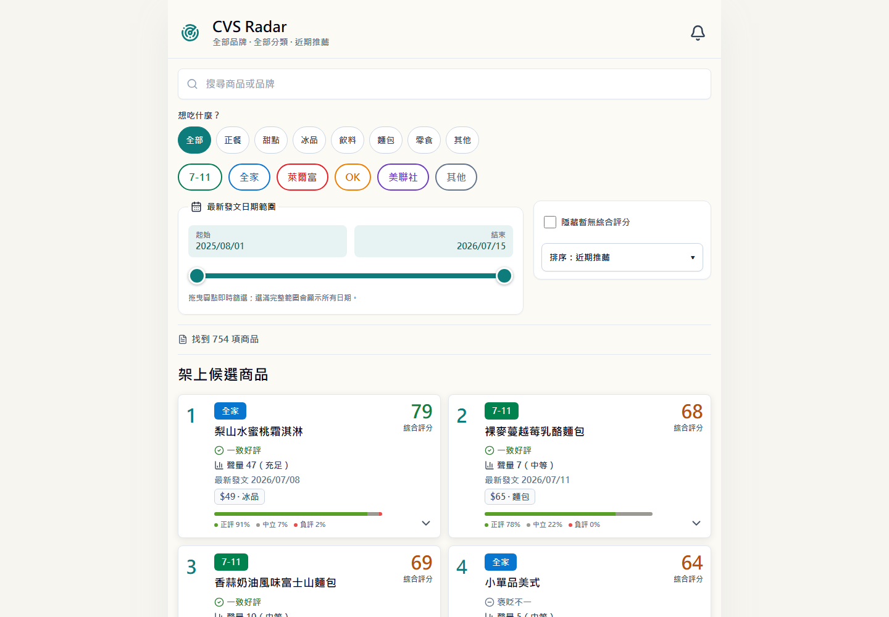
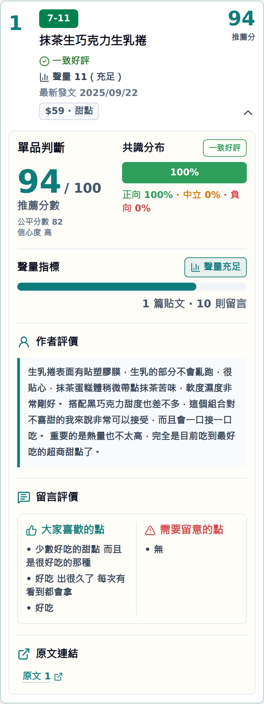
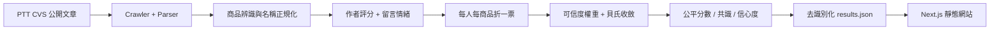

# CVS Radar

> 把分散在 PTT CVS 板的超商商品心得，整理成站在貨架前也能快速理解的推薦依據。

[](https://github.com/YuHsunWang/cvs-radar/actions/workflows/ci.yml)
[](https://github.com/YuHsunWang/cvs-radar/actions/workflows/pages.yml)


**[Live Demo](https://cvs-radar.vercel.app/)** ·
**[GitHub Pages Mirror](https://yuhsunwang.github.io/cvs-radar/)** ·
**[評分決策](docs/DECISIONS.md)** ·
**[標註規範](docs/labeling_guideline.md)**

CVS Radar 是一個端到端的 NLP 與資料產品專案。系統從公開討論中辨識商品、整合作者評價與留言情緒、降低可疑或重複訊號的影響，再以手機優先的介面呈現推薦分、共識、聲量與原文證據。公開網站使用去識別化的靜態資料，不包含帳號層級分析。

## Product Preview

<p align="center">
  
  &nbsp;&nbsp;
  
</p>

## 使用者問題

超商新品討論通常散落在不同文章與推文中。單看一篇心得容易受到作者偏好影響，直接看推文又必須自行判斷反諷、離題回覆與樣本數。CVS Radar 將這些訊號整理成可比較的商品層級資訊：

- **今天想吃什麼？** 以正餐、甜點、冰品、飲料、麵包、零食快速縮小選擇。
- **值得買嗎？** 收合卡片直接顯示推薦分、共識、聲量、日期與價格。
- **大家為什麼喜歡或不喜歡？** 展開後依序閱讀作者評價、留言評價與原文。
- **這個分數可靠嗎？** 低樣本商品不顯示推薦分或百分比分布，避免過度解讀。

目前公開快照包含 **772 項商品**，支援 7-11、全家、萊爾富、OK、美聯社及其他通路。

## 核心功能

- NFKC 正規化即時搜尋，支援商品名稱與品牌。
- 使用者意圖分類與品牌 chips，可交叉篩選。
- 發文時間、討論聲量、推薦分皆可雙向排序。
- 最低推薦分與發文日期區間篩選。
- 手機優先的卡片式排行與 inline 詳情展開。
- 作者評價萃取：保留口味、口感、份量、價格、回購意圖等完整句。
- 留言正向／中立／負向共識分布與代表性優缺點。
- 原文連結與清楚的資料不足狀態。
- 純靜態 Next.js export，載入後所有查詢都在瀏覽器本地完成。

## How It Works



### 評分與可信度

1. 作者自評與留言情緒先轉為一致的 0–1 尺度。
2. 同一帳號對同一商品折成一個立場，避免洗版放大影響。
3. 作者自推、離題反應與純附和留言不納入計分。
4. 可疑訊號只降低內部權重，不公開標記或指控個別帳號。
5. 公平分數使用 50 分先驗做貝氏收斂，降低小樣本暴衝。
6. 使用固定錨點將公平分數轉為穩定的推薦分；新增其他商品不會改變既有商品分數。
7. 有效樣本不足時，前端只呈現「樣本少」，不顯示看似精確的推薦分與百分比。

### 作者評價萃取

萃取流程會跨同商品文章選擇最多三句與購買決策相關的完整句，兼顧味道、口感、份量、價格、食用方式與回購意圖。處理過程會移除網址、站台簽名、模板文字、近似重複內容與破損括號，但不以生成模型改寫作者意思。

```bash
python scripts/rebuild_review_excerpts.py --posts data/posts.jsonl
```

## Privacy by Design

- 公開前端只讀取商品層級的 `web/public/data.json`。
- 帳號 profile、contributors 與可疑分數不會輸出到網站。
- 公開資料保留原文連結以便查證，但不建立公開個人評分檔案。
- 可疑偵測被視為降權用弱訊號，而不是對真實使用者的判定。

## Tech Stack

| Layer | Technology |
|---|---|
| Data collection | Python, Requests, Beautiful Soup |
| NLP / scoring | Rule-based sentiment, SnowNLP adapter, Bayesian shrinkage |
| Service layer | Framework-independent query API, FastAPI adapter |
| Web | Next.js 15, React 19, TypeScript, Tailwind CSS, Lucide |
| Quality | Pytest, Vitest, Ruff, TypeScript / Next.js production build |
| Deployment | GitHub Actions, GitHub Pages static export |

## Repository Structure

```text
cvs_radar/                 parsing, sentiment, scoring, service and reporting
scripts/                   audit, labeling and excerpt rebuild utilities
tests/                     backend and data-build regression tests
web/
  app/                     Next.js App Router entry
  components/              filters, product cards and detail views
  lib/                     typed search, filter and sort logic
  public/data.json         de-identified browser payload
data/results.json          precomputed product-level snapshot
docs/screenshots/          portfolio screenshots generated from production build
.github/workflows/         CI and GitHub Pages deployment
```

## Run Locally

### Web app

```bash
cd web
npm ci
npm run build:data
npm test
npm run dev
```

Open `http://localhost:3000`.

### Data pipeline and API

```bash
python -m pip install -r requirements.txt
python run.py --demo
python -m uvicorn cvs_radar.api:app --reload
```

The demo source is offline and uses synthetic sample posts. Crawling requires network access and should respect the source site's rate limits and terms.

## Verification

```bash
python -m pytest -q
ruff check cvs_radar scripts tests web/build_data.py

cd web
npm test
npm run build
```

The current suite covers parsing edge cases, product normalization, sentiment attribution, one-user caps, consensus distribution, author excerpt extraction, score calibration, search, category and brand filtering, date boundaries, six sort modes and static production export.

## GitHub Pages

Every push to `main` runs `.github/workflows/pages.yml`:

1. rebuild the de-identified frontend payload;
2. build the Next.js static export with the `/cvs-radar` base path;
3. upload `web/out` as a Pages artifact;
4. deploy to `https://yuhsunwang.github.io/cvs-radar/`.

CI runs backend and frontend checks independently through `.github/workflows/ci.yml`.

The primary portfolio deployment is <https://cvs-radar.vercel.app/>. Vercel is
connected to this repository with `web/` as its Root Directory; pushes to
`main` create a new production deployment. GitHub Pages remains a static mirror.

## Limitations and Next Steps

- Rule-based sentiment still has difficulty with sarcasm, memes and implicit comparisons.
- Product grouping relies on normalized names and may split or merge unusual naming variants.
- The current public site is a precomputed snapshot rather than a real-time feed.
- Future work: larger manually labeled gold set, calibrated model comparison, additional public sources and scheduled snapshot refresh.

## Disclaimer

This is an independent portfolio project and is not affiliated with PTT or any convenience-store brand. Product opinions are derived from public user-generated content and should be treated as decision support, not objective product quality claims.
