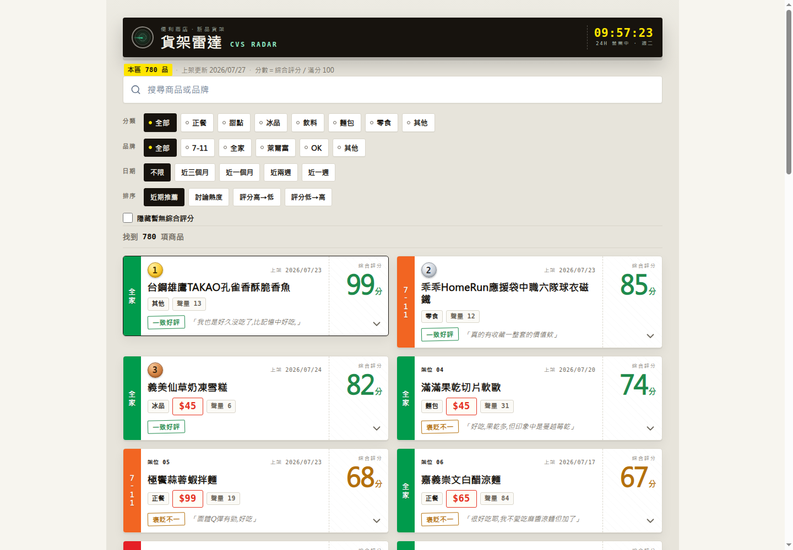
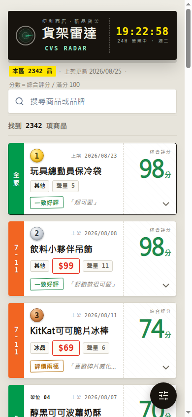
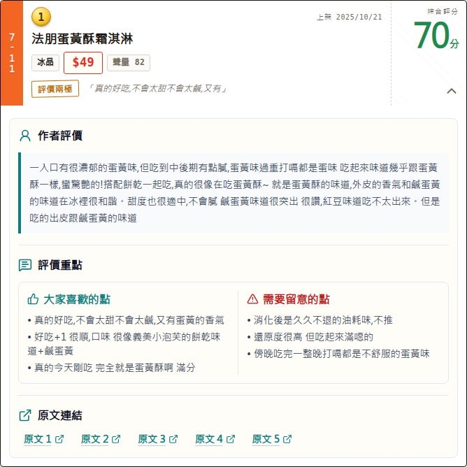
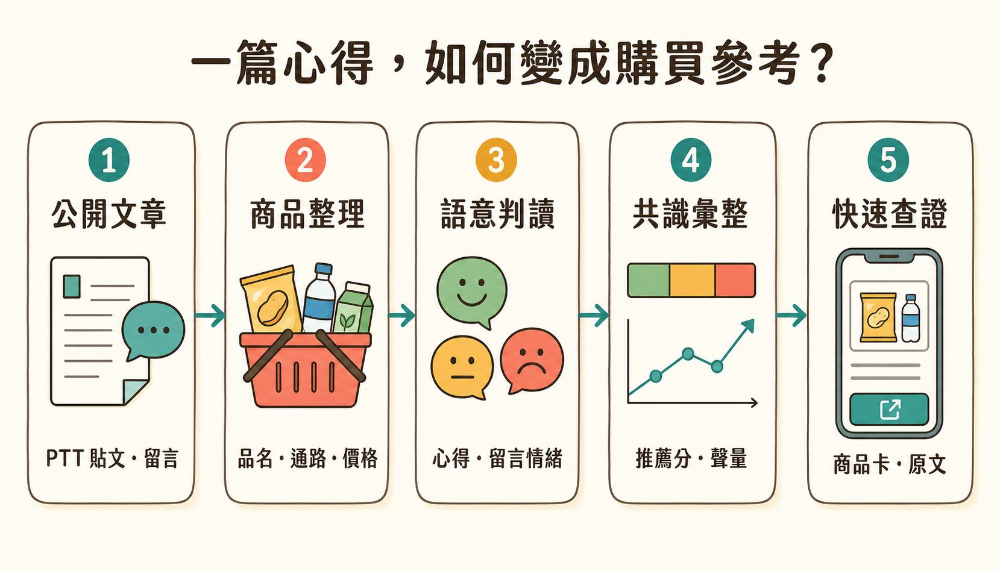
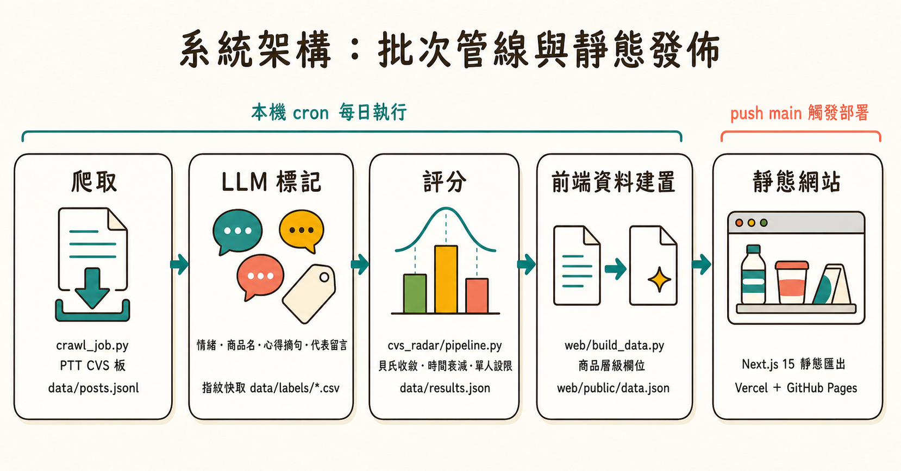

# CVS Radar

> 站在超商貨架前，30 秒決定買哪一個。

[](https://github.com/YuHsunWang/cvs-radar/actions/workflows/ci.yml)
[](https://github.com/YuHsunWang/cvs-radar/actions/workflows/pages.yml)


**[線上試用](https://cvs-radar.vercel.app/)** ·
**[English](README.en.md)**

超商新品好不好吃，答案常常散在 PTT CVS 板的心得和推文裡。同一個商品可能有好幾篇討論，要一篇篇找其實很花時間。CVS Radar 把這些評價整理成排行榜，讓人可以快速比較大家怎麼評、口味怎麼樣，再決定要不要買。

站上收錄數千項超商商品，資料來自 2024 年 6 月以來累積的 PTT CVS 貼文與留言。這些內容會經過爬取、語意判讀和評分整理，並透過每日排程持續更新。

## 產品樣貌

<p align="center">
  
</p>

<p align="center">
  預設以「近期推薦」呈現最近值得買的商品，也能切換「討論熱度」看現在大家在聊什麼。
</p>

<p align="center">
  
  &nbsp;&nbsp;
  
</p>

<p align="center">
  手機優先的卡片式排行；展開任一張卡，就能讀逐篇編號的作者評價摘要、正負向的評價重點，以及每一則的 PTT 原文連結。
</p>

## 要解決的問題

超商新品的討論散在不同文章與推文裡。單看一篇心得會被作者口味帶著走，直接翻推文又得自己判斷反諷、離題回覆和樣本數夠不夠。CVS Radar 把這些訊號整理成商品層級、可以互相比較的資訊：

- **今天想吃什麼？** 以正餐、甜點、冰品、飲料、麵包、零食快速縮小範圍。（標記層分得更細——便當、鹹食、泡麵、乳品、周邊等 11 類——前端再收攏成這 6 個加「其他」。）
- **值得買嗎？** 收合的卡片就顯示推薦分、共識、聲量、日期與價格。
- **大家為什麼喜歡或不喜歡？** 展開後依序讀作者評價、留言評價與原文。
- **這個分數可信嗎？** 樣本太少的商品**不顯示**推薦分與百分比分布。約四分之一的商品因此留白——寧可不說，也不給一個看起來很精確、其實只有三個人講過的數字。

## 一篇心得，如何變成購買參考？

<p align="center">
  
</p>

1. **收集公開心得**——讀取 PTT CVS 板的商品文與留言。
2. **整理成同一商品**——辨識通路、品名與價格，合併名稱不同但實際相同的商品。
3. **保留真正的使用感受**——作者心得維持原句；留言辨識正向、中立、負向，排除離題、純附和與只談其他通路的內容。同一篇涉及多項商品時，排除鄰近商品的敘述。
4. **彙整共識與時效**——同一人不因重複留言被放大；樣本不足不給分。「近期推薦」兼顧評價與新鮮度（24 天半衰期），「討論熱度」回答現在大家在聊什麼。
5. **回到證據查證**——卡片先給快速摘要，展開後仍能讀作者評價、代表留言與原文連結。

## 系統架構

<p align="center">
  
</p>

跑在使用者瀏覽器裡的只有一份靜態 JSON；所有語意判讀與統計都在發佈前的批次管線完成。載入後的搜尋與篩選都在本地即時完成，沒有後端。

| 層 | 技術 |
|---|---|
| 資料收集 | Python、Requests、Beautiful Soup |
| 語意標記 | LLM 判讀五層（情緒、商品名、心得摘句、代表留言、分類），各以內容指紋快取於 `data/labels/*.csv` |
| 評分 | 規則式情緒、SnowNLP adapter、貝氏收斂、時間衰減 |
| 服務層 | 框架無關的查詢 API，附 FastAPI adapter |
| 前端 | Next.js 15、React 19、TypeScript、Tailwind CSS、Lucide |
| 品質 | Pytest、Vitest、Ruff、TypeScript／Next.js production build |
| 部署 | Vercel（主要）＋ GitHub Actions／GitHub Pages 靜態鏡像 |

## 評分怎麼算

一則留言不是一票。它先被判斷「算不算數」，再被賦予一個權重，最後和同一商品的其他意見一起收斂成分數。實作在 `cvs_radar/scoring/compute.py`，參數集中在 `config.yaml`。

### 1. 每則意見的權重

```
weight = credibility(帳號) × role_weight(角色) × exp(−λ · 天數)
```

- **時間衰減** `λ = 0.005`，半衰期約 139 天。超商商品會換配方與供應商，三年前的評價不該和上個月等重。
- **角色權重** 作者與留言者目前都是 `1.0`：作者自評樂觀但只有一個樣本，留言群體較客觀但雜訊多，兩邊互相抵銷後不再另外加權。
- **帳號可信度** `credibility = max(0.1, 1 − suspicion)`，下限 0.1 讓可疑帳號被壓低而不是被消失。

### 2. 可疑分怎麼來（`cvs_radar/preference.py`）

對每個帳號統計它在各品牌下的留言數與平均情緒，再組出五個弱訊號加權相加。活躍度低於 5 則的帳號一律不評（樣本太少，算了也只是雜訊）：

| 特徵 | 權重 | 抓什麼 |
|---|---|---|
| `one_sided` | 0.35 | 捧一個品牌同時貶其他品牌 |
| `single_brand` | 0.20 | 發言幾乎集中在單一品牌 |
| `extreme` | 0.20 | 打分老是落在 \|sentiment\| ≥ 0.85 的兩端 |
| `burst` | 0.15 | 24 小時內對同品牌連續留言 ≥ 3 則 |
| `template_like` | 0.10 | 留言彼此的字元 bigram Jaccard ≥ 0.8（樣板文） |

這個分數**只在內部降權，不對外標記任何帳號**——弱訊號撐得起降權，撐不起點名。發佈的 JSON 不含帳號層欄位，由 `test_publish_privacy.py` 守著。

另有一條獨立的「業配指控」機制（`SHILL_DETECTION`）：留言區指控某篇心得是業配時，降權的是**被指控的那篇文章的作者**，不是所有談論該商品的人。需要至少兩個不同帳號指控才算數——語料裡 16 篇被指控的文章有 12 篇只有一個人喊，喊「業配」的成本太低，一個人喊不能當結論。這條在 2026-08 修過一次：原本的寫法把整個商品的所有意見一起降權，而 `μ`、`σ`、`n_eff` 都會除以總權重，等比例縮放等於什麼都沒變，只有 `fair01` 被拉向 0.5 的先驗——結果一個評價差的商品，會因為被說是業配而分數**變高**。

### 3. 一個人只算一票

`per_user_cap` 會先把同一帳號在同一商品下的所有發言（包含他既是作者又去別人串留言的情況）依各自 decay 加權平均，折成單一 stance，再進商品層。否則一個人在同串連噓五則就等於五個人。

### 4. 貝氏收斂與「不給分」

```
fair01 = (prior_strength · μ₀ + Σ wᵢsᵢ) / (prior_strength + Σ wᵢ)     # μ₀ = 0.5, prior_strength = 1.0
n_eff  = (Σ wᵢ)² / Σ wᵢ²
```

`n_eff` 是有效樣本數：權重越集中在少數人身上，它越小。`n_eff < 3` 就判為「資料不足」，前端不顯示綜合評分也不顯示正／中／負百分比——目前 2,342 項商品有 567 項（24.2%）因此留白。語料從 800 篇擴到 2,700 篇貼文之後，這個比例幾乎沒動，因為新進來的多半是討論度本來就低的舊商品。

共識標籤由加權平均 `μ` 與加權標準差 `σ` 分帶：`σ ≥ 0.26` 為評價兩極；`μ ≥ 0.68` 且 `σ ≤ 0.25` 為一致好評；`μ ≤ 0.45` 且 `σ ≤ 0.25` 為一致負評；其餘為褒貶不一。這組門檻是 2026-07-20 對著實際分數分布重新校準的，不是拍腦袋值。

### 5. 為什麼加了 LLM 還能重現

五個語意層（情緒、商品名、心得摘句、代表留言、分類）都由 LLM 判讀，但每筆結果以內容指紋當 key 快取進 `data/labels/*.csv` 並進版控。相同輸入不再呼叫模型，也必然產生相同的分數。

指紋的設計原則是**把「模型當時看到的每一樣東西」都放進 key**，五層各有各的組成。以情緒層為例（`sentiment.py:sentiment_fingerprint_v2`）：

```
SHA-256( 文章 ID ｜ 推噓標籤 ｜ NFKC 正規化留言 ｜ 品牌 ｜ 商品名 ｜ 文章標題 ｜ prompt 版本 )
```

品牌與商品名在裡面，是因為它們會改變答案——「好油」在鹹酥雞底下是稱讚，在咖啡底下是抱怨。第一版的 key 只有前三項，結果一篇文章被重新切分或改標題之後，仍然沿用在不同脈絡下判出的舊標籤。prompt 版本在裡面，則是為了讓改寫評分準則這件事會自動讓舊答案失效，而不是永遠有效。

因此驗證方式是**改動前後各跑一次完整管線、比對整份結果集**，而不是只看單元測試綠燈。例如導入指紋標籤那次的量化結果是：全目錄 93% 商品分數變動、581 項下降 145 項上升、平均 −10.1 分，抽驗掉最多的 5 項逐則核對後確認方向正確。

## 這個專案想證明的事

- **讓 LLM 參與，但不讓結果變成不可重現。** 五個語意層都由 LLM 判讀，但每筆結果都以內容指紋（含 prompt 版本）快取進版控。相同輸入重算不再呼叫模型，也產生完全相同的分數——CI 因此跑得動，成本也可控。這也讓語料擴充幾乎免費：2026-08 把貼文從 800 篇補到 2,700 篇時，重爬回來的舊文指紋完全命中既有快取，只有新內容需要付費標記。
- **統計上不逞強。** 貝氏收斂、單人設限、時間衰減，加上樣本不足就不給分。願意在產品上留白，比湊出一個好看的排行難。
- **端到端自己蓋完並且真的在跑。** 從爬蟲、標記管線、評分到靜態前端，資料由每日排程重算後發佈，不是一次性的 demo。
- **驗收方式要對得上想驗的東西。** 管線給定相同輸入是確定性的，所以改動的驗證方式是前後各跑一次完整管線、比對結果集，而不是只看單元測試綠燈。

細節見 [評分決策](docs/DECISIONS.md)、[標註規範](docs/labeling_guideline.md) 與 [Ops 管線](docs/ops-pipeline.md)。

## 專案結構

```text
cvs_radar/                 解析、情緒、評分、服務與報表
scripts/                   稽核、標記與摘句重建工具
tests/                     後端與資料建置的回歸測試
web/
  app/                     Next.js App Router 入口
  components/              篩選、商品卡與詳情
  lib/                     型別化的搜尋、篩選與排序邏輯
  public/data.json         瀏覽器讀取的商品層級 payload
data/results.json          預先計算的商品層級快照
data/labels/               以指紋為 key 的 LLM 標記快取
docs/screenshots/          由 production build 產生的截圖
.github/workflows/         CI 與 GitHub Pages 鏡像部署
```

## 在本地執行

### 網站

```bash
cd web
npm ci
npm run build:data
npm test
npm run dev
```

開啟 `http://localhost:3000`。

### 資料管線與 API

```bash
python -m pip install -r requirements.txt
python run.py --demo
python -m uvicorn cvs_radar.api:app --reload
```

### 全家食品安全資料（獨立批次工具）

`scripts/crawl_family_food.py` 僅讀取全家食品安全專區的公開頁面，不共用限定
PTT URL 的 `PttCrawler`。使用前請再次查看該站的 `robots.txt` 與使用條款；尊重
網站負載（預設請求間隔 1 秒），不得繞過 CAPTCHA、登入或其他存取控制。照片預設
只保留官方 URL，只有明確傳入 `--download-images` 才會下載，且輸出目錄已忽略版控。

```bash
python scripts/crawl_family_food.py --start-page 1 --max-pages 3 \
  --request-delay 1.5 --output data/family_food/products.jsonl
python scripts/crawl_family_food.py --max-pages 1 --download-images \
  --image-dir data/family_food/images
```

JSONL 每行是一項商品，包含 `product_id`、`name`、`detail_url`、`image_urls`、
`serving_size`、`servings_per_container`、八項營養欄位（`calories`、`protein`、
`fat`、`saturated_fat`、`trans_fat`、`carbohydrates`、`sugar`、`sodium`）、
`ingredients`、`allergens` 與 UTC `crawled_at`。數值欄位均為
`{"value", "unit", "raw_text"}`；缺漏或無法解析者為 `null`，不會誤填為零。

截至本功能開發時，執行環境的網路代理拒絕連到該主機，因此無法可靠宣稱現場頁面
是 server-rendered HTML 或 XHR/Fetch，也無法代為確認當下的 robots/條款內容。
實際執行前應在瀏覽器 Network 面板確認 `/Web_FFD_2022/results/{page}` 的分頁、
商品 ID、詳情 URL 與 JSON envelope；若網站 HTML 或 API 改版，請先保存不含個資的
新回應為本機 fixture，再同步更新 `parse_list_html`、`parse_api_response` 或
`parse_product_html` selector 與測試。測試不得直接連線官方網站。

`--demo` 使用離線的合成範例貼文。實際爬取需要網路，並應遵守來源站台的速率限制與使用條款。

## 驗證

```bash
python -m pytest -q
ruff check .

cd web
npm test
npm run build
```

三百多個自動化測試涵蓋解析邊界情況、商品正規化、情緒歸屬、單人設限、共識分布、作者摘句抽取、分數校準、搜尋、分類與品牌篩選、日期邊界、四種排序模式與靜態匯出。

## 部署

主要部署在 <https://cvs-radar.vercel.app/>，Vercel 以 `web/` 為 Root Directory 連接本 repo，每次 push 到 `main` 就產生新的 production deployment。應用本身是 Next.js 靜態匯出（`output: 'export'`）。

<https://yuhsunwang.github.io/cvs-radar/> 是同一個站的靜態鏡像，由 `.github/workflows/pages.yml` 在每次 push 到 `main` 時重建 payload、以 `/cvs-radar` base path 建置、上傳並部署。

兩邊都讀同一份 `web/public/data.json`。這份資料由 repo 外部的排程主機執行本專案的 cron wrapper 後重算並 commit 回 `main`；repository 本身不包含或證明該主機的 crontab。排程若停擺，repo 不會自己更新，`scripts/check_data_freshness.py` 是可觀察的守門員。CI 則透過 `.github/workflows/ci.yml` 獨立跑前後端檢查。

## 限制與後續

- 語意分類仍可能誤讀反諷、迷因與省略主詞的比較句，因此保留人工覆寫與原文查證。
- 商品分群依賴正規化後的名稱，遇到罕見命名變體仍可能拆開或誤合。
- 公開站台是預先計算的快照，不是即時串流。
- 後續：更大的人工標註 gold set、校準過的模型比較、更多公開來源。

## 聲明

這是獨立的作品集專案，與 PTT 及任何超商品牌均無關聯。商品評價來自公開的使用者內容，應視為決策輔助，而非客觀的商品品質主張。
